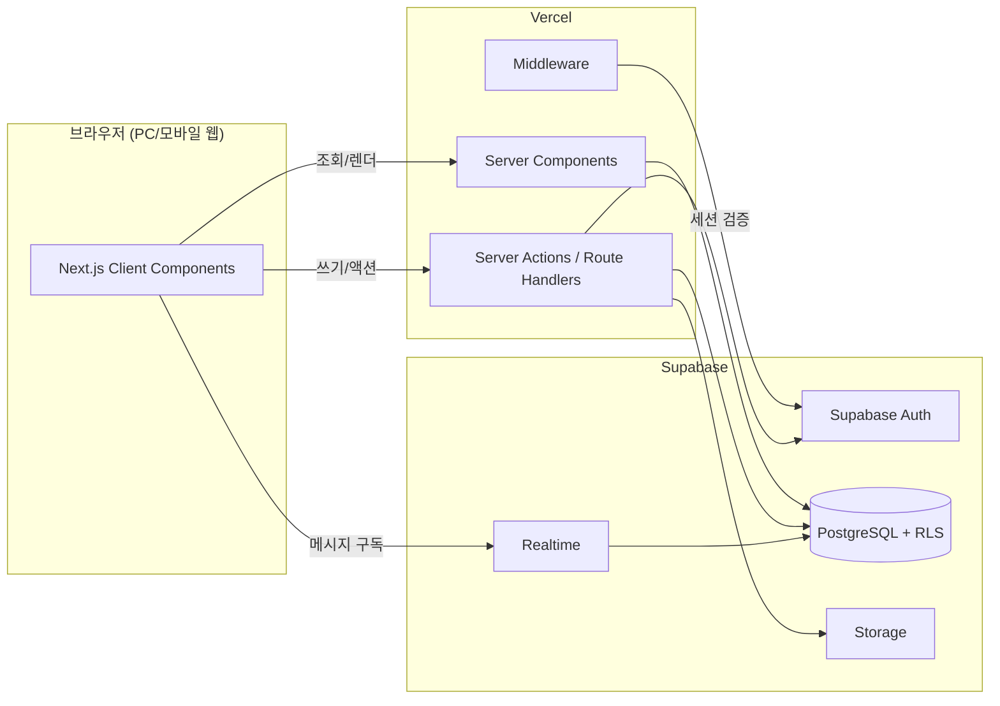
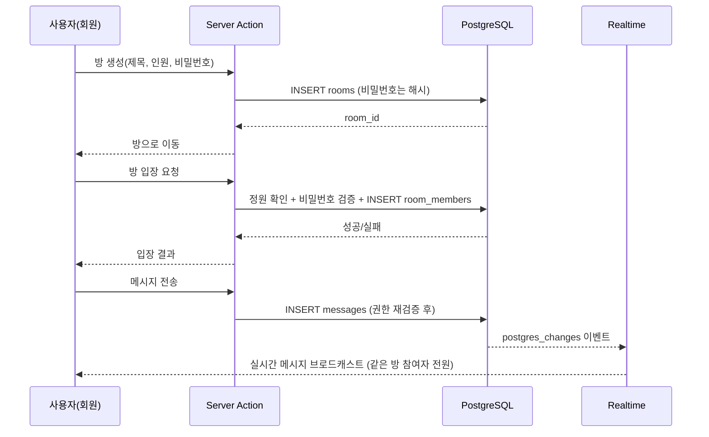
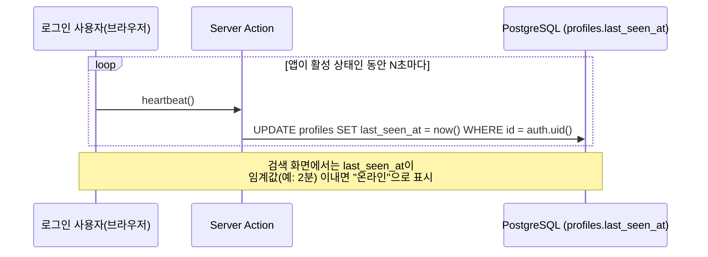
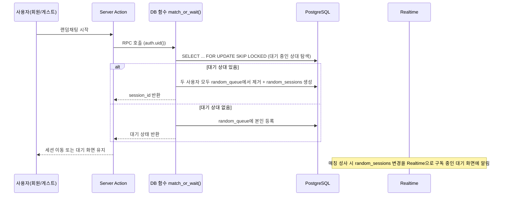

# 수다온(sudaon) 아키텍처

> 이 문서는 `PRD.md`의 요구사항과 `ROADMAP.md`의 Phase 구성을 구현하기 위한 시스템 구조를 정의한다. 테이블 상세 컬럼/제약조건은 `DB_SCHEMA.md`, 태스크 단위 작업은 `DEVELOPMENT_PLAN.md`에서 다룬다.

---

## 1. 전체 시스템 구성



- **Server Components**: 방 목록, 프로필 등 읽기 위주 화면 렌더링
- **Server Actions**: 방 생성/입장, 매칭 요청, 강퇴, 계정 탈퇴 등 상태를 바꾸는 모든 동작 — 권한 재검증은 항상 여기서 수행
- **Realtime**: 메시지 수신, 참여자 변경 등 클라이언트가 구독하는 실시간 이벤트만 담당
- **기존 3-클라이언트 패턴 유지**: `lib/supabase/server.ts`, `client.ts`, `middleware.ts` (CLAUDE.md 규칙 그대로 적용)

---

## 2. 인증 및 세션 아키텍처

### 2.1 회원 (기존 구현 재사용)

- Supabase Auth (이메일/OAuth) + `profiles` 테이블 그대로 사용
- `auth.uid()`가 곧 회원 식별자

### 2.2 게스트(비로그인) 식별자 — Supabase 익명 인증 사용

PRD는 게스트를 "브라우저 세션 기반 임시 ID"로 정의하는데, 이를 직접 쿠키/토큰으로 구현하면 RLS에서 회원과 게스트를 별도 경로로 검증해야 해 정책이 복잡해진다. 대신 **Supabase Anonymous Sign-in**(`signInAnonymously`)을 사용해 게스트도 `auth.uid()`를 갖게 한다.

- 홈에서 "랜덤채팅 시작" 클릭 시, 세션이 없으면 익명 로그인을 발급
- 이후 모든 RLS 정책은 회원/게스트 구분 없이 `auth.uid()` 기준으로 통일
- 게스트가 이후 실제 회원가입/로그인으로 전환하는 흐름은 MVP 범위 밖 (§PRD 1.3 제외 범위와 일치)
- 세션 종료(브라우저 종료) 시 익명 계정은 재사용하지 않고 새로 발급 — 별도 정리(cleanup) 배치 없이도 `random_queue`/`random_sessions`는 TTL성 정리 로직으로 관리 (§4 참고)

> 이 결정은 RLS 정책을 단순하게 유지하기 위한 기본안이며, `DEVELOPMENT_PLAN.md` 작성 전 확정한다.

---

## 3. 라우팅/디렉터리 구조 (신규 추가분)

기존 `app/auth/*`, `app/protected/*`는 그대로 두고, 채팅 기능은 아래와 같이 신설한다.

```
app/
  page.tsx                     # 홈 (수다온 브랜딩으로 교체)
  random/
    page.tsx                   # 매칭 대기 화면
    [sessionId]/page.tsx       # 랜덤채팅 화면
  rooms/
    page.tsx                   # 방 목록
    new/page.tsx                # 방 생성
    [roomId]/page.tsx           # 방채팅 화면
  actions/
    rooms.ts                    # 방 생성/입장/강퇴 서버 액션
    random.ts                   # 매칭 진입/취소/종료 서버 액션
    messages.ts                  # 메시지 전송 서버 액션 (텍스트/이미지)
    account.ts                   # 계정 탈퇴 서버 액션
lib/
  queries/
    rooms.ts                    # 방 목록/상세 조회
  realtime/
    messages.ts                  # Realtime 구독 훅
  schemas/
    room.ts                      # 방 생성 폼 검증 스키마
```

미들웨어의 공개 경로 예외 목록(`middleware.ts`)에 `/random`, `/rooms` 조회 경로(게스트 접근 허용 구간)를 추가해야 한다 — 입장/생성/전송은 서버 액션 단에서 로그인 여부를 재검증한다.

---

## 4. 방채팅 데이터 흐름



- 메시지 조회/전송 권한은 `room_members`에 현재 사용자가 존재하는지로 RLS에서 검증
- 강퇴는 `room_members` row를 제거 + 강퇴 이력 테이블(또는 컬럼)에 기록해 재입장 차단 (ROOM-07)

---

## 5. 사용자 검색 및 온라인 상태 아키텍처

### 5.1 닉네임 검색

- `profiles.username`에 대해 부분 일치 검색(`ILIKE`)을 지원 — `pg_trgm` 확장 + trigram GIN 인덱스로 성능 확보 (자세한 인덱스는 `DB_SCHEMA.md`)
- 검색은 Server Component 또는 Route Handler에서 로그인 사용자만 호출 가능 (SEARCH-01)
- 쿼리에서 `is_anonymous = false` 조건으로 게스트 계정을 항상 제외 (SEARCH-03)

### 5.2 온라인 여부 판단 — `last_seen_at` 하트비트

Supabase Realtime Presence는 특정 채널에 접속한 클라이언트끼리만 서로의 상태를 알 수 있는 구조라, "검색창에 아무 닉네임이나 입력해서 온라인 여부를 확인"하는 요구사항과는 맞지 않는다. 대신 단순한 하트비트 방식을 사용한다.



- 클라이언트는 탭이 보이는 동안(`visibilitychange` 활용)에만 주기적으로 `last_seen_at`을 갱신
- 별도 배치/크론 없이, 검색 결과를 조회하는 시점에 `now() - last_seen_at < interval '2 minutes'`로 온라인 여부를 계산 (스냅샷 방식이라 초 단위 정확도는 보장하지 않음 — MVP 요구사항에는 충분)
- `last_seen_at` 갱신은 기존 "본인 프로필 수정" RLS 정책(`auth.uid() = id`)을 그대로 재사용, 별도 정책 불필요

---

## 6. 랜덤채팅 매칭 아키텍처

매칭은 동시성 문제가 가장 큰 영역(PRD RND-02, RND-03)이므로 애플리케이션 서버가 아닌 **PostgreSQL 함수(트랜잭션) 내부**에서 원자적으로 처리한다.



핵심 원칙:

- `match_or_wait()` 함수 하나로 "대기열 확인 → 매칭 → 큐 제거"를 단일 트랜잭션에서 처리해 두 사용자가 동시에 매칭되는 경쟁 상태를 방지 (`FOR UPDATE SKIP LOCKED`)
- 한 사용자가 이미 대기 중이거나 세션이 있으면 함수 내부에서 거부 (RND-02)
- 매칭 대기 화면은 `random_queue`/`random_sessions`에 대한 Realtime 구독으로 매칭 성사를 감지 (폴링 없음)
- 대화 종료·이탈 시 `random_sessions` 종료 처리 + 상대방에게 종료 이벤트 전파

---

## 7. Realtime 구독 전략

| 대상 | 방식 | 채널 범위 |
|---|---|---|
| 방채팅 메시지 | Postgres Changes (`messages` INSERT) | `room_id` 단위 필터 |
| 방 참여자 변경(강퇴 등) | Postgres Changes (`room_members`) | `room_id` 단위 필터 |
| 랜덤채팅 메시지 | Postgres Changes (`messages` INSERT) | `session_id` 단위 필터 |
| 매칭 성사 알림 | Postgres Changes (`random_sessions` INSERT) | 본인 `user_id` 필터 |

모든 구독은 RLS가 적용된 상태로 이뤄지므로, 클라이언트는 자신이 접근 가능한 행에 대한 이벤트만 수신한다 (§7.1 보안 요구사항과 일치).

---

## 8. Storage 아키텍처

| 버킷 | 경로 규칙 | 접근 |
|---|---|---|
| `chat-images` | `rooms/{room_id}/{uuid}.{ext}` 또는 `sessions/{session_id}/{uuid}.{ext}` | 업로드: 서버 액션이 서명 업로드 URL 발급 → 클라이언트가 Storage에 직접 전송 / 조회: 참여자만 (Storage RLS) |
| `avatars` (기존) | 그대로 유지 | 기존 정책 유지 |

- **`rooms/`·`sessions/` 접두사가 필요한 이유**: Storage RLS는 경로 세그먼트만으로 참여자 여부를 검증해야 하는데, 첫 세그먼트가 곧바로 uuid면 `rooms`와 `random_sessions` 중 어느 테이블을 조회할지 판별할 수 없다(둘 다 uuid라 형태로도 구분 불가).
- **업로드가 서버를 거치지 않는 이유**: Next.js 서버 액션 body 상한이 기본 1MB라 5MB 파일을 액션으로 넘길 수 없고, 상한을 올리면 5MB가 서버리스 함수를 그대로 통과해 낭비다. 서버 액션은 "업로드 허가"(서명 URL)만 발급한다.
- 검증은 3중: ① 클라이언트 사전 검사(UX) ② **버킷 레벨 `file_size_limit`(5MB) / `allowed_mime_types`(JPG·PNG·WEBP) — Storage 서버가 강제하므로 우회 불가** ③ 메시지 INSERT 시 업로드된 오브젝트의 실제 size/mimetype 재확인. 검증 실패 시 오브젝트를 삭제해 메시지로 만들지 않는다.
  - 한계: 파일이 서버를 거치지 않아 **매직바이트 검사는 불가능**하다(선언된 Content-Type만 검증됨). 비공개 버킷 + UUID 경로 + `next/image` 경유라 실행 위험은 없어 MVP에서는 수용한다.
- 파일명은 UUID로 강제해 추측 불가능하게 함 (§7.1)
- 조회는 서명 URL(TTL 1시간). 초기 로드는 배치 발급, Realtime 수신 건은 클라이언트가 단건 발급(Storage SELECT RLS가 참여자 여부를 검증).
- **정리**: DB cascade는 Storage 파일을 지우지 않는다. 방/세션이 사라지면 RLS가 자동으로 접근을 차단하고, 실제 파일 삭제는 아카이브 보존 기한(30일)에 맞춰 `/api/cron/cleanup-chat-images`가 수행한다. Postgres에서 `storage.objects`를 직접 DELETE하는 것은 Storage가 막으므로 pg_cron만으로는 처리할 수 없다.

---

## 9. 보안 아키텍처

| 계층 | 조치 |
|---|---|
| RLS | 모든 채팅 테이블(`rooms`, `room_members`, `messages`, `random_queue`, `random_sessions`)에 "참여자만 조회/쓰기" 정책 적용 |
| 서버 액션 | 방 생성/입장/강퇴/탈퇴/매칭은 전부 서버 액션에서 `auth.uid()` 기준 권한 재검증 (클라이언트 입력 신뢰 안 함) |
| 비밀번호방 | 원문 비교 없이 서버 액션에서 해시 비교만 수행 |
| Rate limiting | 메시지 전송/방 생성/이미지 업로드에 기본 요청 횟수 제한 — 아래 참고 |
| 환경 변수 | `SUPABASE_SERVICE_ROLE_KEY` 등 서버 전용 키는 서버 액션/Route Handler 내부에서만 사용, 클라이언트 번들에 노출 금지 |
| 계정 탈퇴 아카이브 보장 | `rooms`/`random_sessions` BEFORE DELETE 트리거가 삭제 경로(정상 나가기, 계정 탈퇴 cascade, 관리자 강제 삭제)와 무관하게 `room_archives`/`random_session_archives`에 스냅샷을 남긴다. 다른 사람 방/세션에 남긴 메시지는 `sender_id` `on delete set null`로 보존되고 "탈퇴한 사용자"로 표시된다(§Phase 7) |

### Rate limiting (Phase 7)

외부 서비스(Upstash 등) 없이 Postgres 카운터 테이블(`rate_limit_events`)로 구현했다. MVP
트래픽 규모에서 Redis급 성능이 필요하지 않고, 이미 모든 쓰기가 SECURITY DEFINER 함수/서버
액션을 거치므로 카운터 체크를 끼워 넣기 쉽다는 판단이다.

```
서버 액션(메시지 전송/방 생성/이미지 업로드 URL 발급)
  → check_and_record_rate_limit(action, max_count, window_seconds) RPC
      최근 window_seconds초 내 해당 action 기록 수가 max_count 미만이면
      기록 후 true, 이상이면 기록 없이 false
  → false면 클라이언트에 "요청 횟수 제한" 에러 반환 (기존 ActionResult 에러 경로 재사용)
```

한도는 메시지 전송(10초당 10회)·방 생성(1일 5회)·이미지 업로드(1분당 10회) — PRD에 구체적
수치가 없어 임의로 정한 기본값이며, 함수 호출 실패 시(네트워크 등) 정상 이용을 막지 않도록
사용자를 통과시킨다(rate limit은 부가 방어선이지 주 기능이 아니라는 판단). 오래된 기록은
`cleanup_old_rate_limit_events()`가 pg_cron으로 7일 지난 것을 매일 정리한다.

---

## 10. 기술적 의사결정 요약

| 결정 | 이유 | 대안(기각) |
|---|---|---|
| 게스트 = Supabase 익명 인증 | RLS 정책을 회원/게스트 통합 처리 가능 | 커스텀 쿠키 임시 ID (RLS 이중 관리 필요) |
| 매칭 로직을 DB 함수로 처리 | 트랜잭션 원자성으로 중복 매칭 방지 (RND-03) | 애플리케이션 레벨 락 (분산 환경에서 취약) |
| Realtime = Postgres Changes | RLS와 자동 연동, 별도 인가 로직 불필요 | Broadcast 채널 (수동 인가 로직 필요) |
| 이미지 = Storage 서명 URL | 참여자만 접근하는 비공개 버킷 정책과 부합 | 퍼블릭 버킷 (접근 제어 불가) |
| 온라인 여부 = `last_seen_at` 하트비트 | 검색 결과에서 쿼리 가능해야 함 (Presence 채널은 조회 불가) | Realtime Presence (검색 화면과 별개 채널이라 조회 어려움) |

---

*— End of ARCHITECTURE —*
